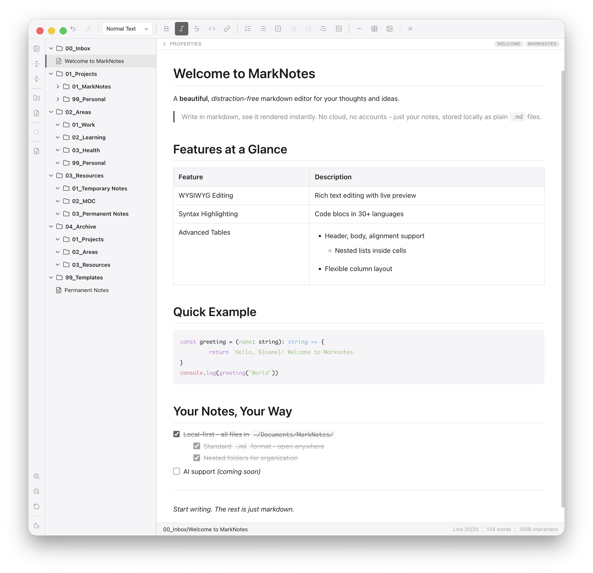
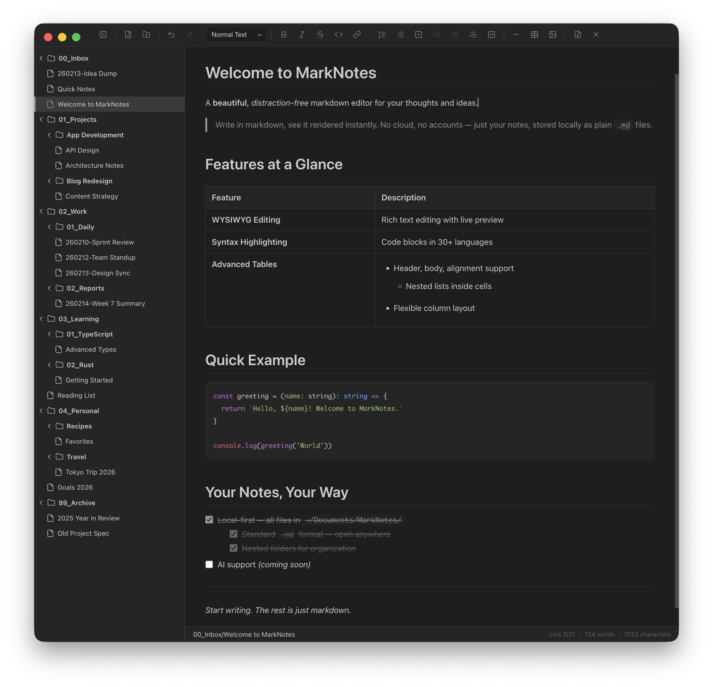

# MarkNotes

<p align="center">
  <strong>Just write, forget syntax</strong>
</p>

<p align="center">
  A beautiful, local-first markdown editor for macOS that combines the power of markdown with the simplicity of WYSIWYG editing.
</p>

<p align="center">
  <strong>Version 1.9.8</strong>
</p>

<p align="center">
  
</p>

<p align="center">
  
</p>

---

## What is MarkNotes?

MarkNotes is a desktop markdown editor designed for writers who want a distraction-free writing experience without learning markdown syntax. Edit your notes visually like a word processor, while everything is saved as clean, portable markdown files on your Mac.

**Your notes, your files, your control** - No accounts, no cloud, no subscriptions. All your notes live in `~/Documents/MarkNotes/` as plain text files you can access anytime.

---

## Why Choose MarkNotes?

✨ **Visual Editing** - Write like you're using Word or Pages. Bold, lists, tables, images - all work without remembering syntax.

🏠 **Local & Private** - Your notes never leave your computer. No sign-ups, no syncing, no privacy concerns.

⚡ **Fast & Simple** - Opens instantly, auto-saves constantly, and stays out of your way.

📝 **Markdown Power** - Export to PDF, edit the raw markdown if needed, and use your notes anywhere markdown works.

🎨 **Beautiful Design** - Clean grey monotone interface with dark mode support.

---

## Key Features

### 📝 Write Without Thinking About Syntax

- **WYSIWYG Editing** - Click buttons to format. See your formatting immediately.
- **Auto-Save** - Changes save automatically 5 seconds after you stop typing. Never lose work.
- **Two Modes** - Write visually (Edit mode) or see the markdown code side-by-side (Code mode)
- **Switch Anytime** - Press `Cmd+1` for visual editing or `Cmd+2` for code view

### 🎨 Rich Formatting Made Easy

- **Headings** - Six levels with a simple dropdown selector
- **Text Styles** - Bold (`Cmd+B`), Italic (`Cmd+I`), Strikethrough, Code
- **Lists** - Bullet lists, numbered lists, and interactive checkboxes
- **Links** - Insert links with `Cmd+K`, including internal document links
- **Blockquotes** - Beautiful styled quotes for emphasis
- **Code Blocks** - Syntax-highlighted code snippets
- **Tables** - Full-featured tables with formatting inside cells
- **Find & Replace** - Search text with `Cmd+F`, replace with `Cmd+Shift+F`
- **Search in Files** - Full-text search across all notes with `Cmd+Shift+H`; supports tag search mode and click-to-jump to any match

### 📊 Professional Tables

- **Easy Creation** - Click the table button to insert a 3×3 table
- **Right-Click Menu** - Add/delete rows and columns, change alignment
- **Rich Content** - Put lists, code, and formatting inside table cells
- **Smart Navigation** - Tab to move between cells, automatically adds rows when needed

### 🖼️ Simple Image Management

- **Drag & Drop** - Drag images from Finder directly into the editor
- **Auto-Organized** - Images stored in `.assets/` folder automatically
- **Resize Anytime** - Right-click images to resize (small/medium/large/original)
- **Export Ready** - Images automatically embedded in PDF exports

### 📁 Organize Your Notes

- **Folders** - Create nested folders to organize by topic or project
- **Sidebar** - Browse all your notes in the collapsible file tree
- **Quick Actions** - `Cmd+N` for new file, `Cmd+Shift+N` for new folder
- **Drag & Drop** - Move files between folders easily

### 📤 Export Your Work

- **PDF Export** - Create professional PDFs with one click (`Cmd+Shift+P`)
- **Formatted Output** - All your styles, images, and tables export perfectly
- **Save Anywhere** - Choose where to save each export

### 🔧 Activity Bar

- **Always Visible** - Icon-only sidebar on the left for quick access to key actions
- **File Tree Controls** - Toggle sidebar, expand/collapse all folders
- **Quick Create** - New file and new folder buttons always within reach
- **Search in Files** - Click the search icon to open global search across all notes
- **Zoom Controls** - Zoom in, zoom out, and reset zoom
- **PDF Export** - One-click export without opening menus
- **Dark Mode Toggle** - Switch between light and dark mode instantly

### 🏷️ Metadata Panel

- **Properties Panel** - Collapsible panel above the editor showing file metadata and YAML frontmatter
- **Default Fields** - Auto-populated id, title, created date, updated date, source, tags, and status
- **Auto Fields** - id, title, created, and updated are set automatically and read-only
- **Editable Fields** - source, status, and tags can be edited directly in the panel
- **Status Tracking** - Three-stage progression: draft, in-progress, stable
- **Tags** - Add tags by pressing Enter, cancel input with Escape; tags display as inline pills in the collapsed header
- **Custom Fields** - Add your own key-value metadata beyond the defaults
- **YAML Frontmatter** - All metadata stored as standard YAML frontmatter in the markdown file
- **Auto-Updated** - The updated date stamps automatically on every save

### 🌓 Native macOS Experience

- **System Integration** - Follows your system dark/light mode, or toggle from the Activity Bar
- **Standard Menus** - Familiar File, Edit, and View menus
- **Keyboard Shortcuts** - Full keyboard control for everything
- **Fast Tooltips** - Hover over any button to see what it does and its shortcut

---

## Download & Install

### System Requirements

- macOS 10.15 (Catalina) or later
- 100 MB free disk space

### Installation

1. **Download** the latest release from the [releases page](../../releases)
2. **Open** the downloaded `.dmg` file
3. **Drag** MarkNotes to your Applications folder
4. **Launch** MarkNotes from Applications or Spotlight

On first launch, MarkNotes creates a `MarkNotes` folder in your Documents and adds a welcome note to help you get started.

---

## Getting Started

### Create Your First Note

1. Launch MarkNotes
2. Press `Cmd+N` or click the new file button in the Activity Bar
3. Choose a location and name for your note
4. Start writing!

### Format Your Text

Use the formatting buttons in the toolbar or keyboard shortcuts:

- **Bold** - Select text and press `Cmd+B`
- **Italic** - Select text and press `Cmd+I`
- **Headings** - Use the dropdown to choose H1-H6
- **Lists** - Click the list buttons or press `Cmd+Shift+8` for bullets

### Add a Table

1. Click the table icon in the toolbar
2. A 3×3 table appears at your cursor
3. Click in cells to start typing
4. Press Tab to move to the next cell
5. Right-click any cell for more options (add/remove rows, change alignment)

### Insert Images

**Drag & Drop** - Simply drag image files from Finder into the editor.

**Or use the image button:**

1. Click the image icon in the toolbar
2. Select an image file from your computer
3. Optionally add alt text (description)
4. Click "Insert Image"
5. Right-click the image anytime to resize or edit

### Create Links

1. Select the text you want to turn into a link
2. Press `Cmd+K`
3. Enter the URL, or type `#` to see a list of headings in your document
4. Click "Insert Link"

### Export to PDF

1. Press `Cmd+Shift+P` or click the PDF export button in the Activity Bar
2. Choose where to save your PDF
3. Done! Your formatted document is ready to share

---

## Keyboard Shortcuts

### Files & Navigation

| Action              | Shortcut      |
| ------------------- | ------------- |
| New File            | `Cmd+N`       |
| New Folder          | `Cmd+Shift+N` |
| Force Save          | `Cmd+S`       |
| Close File          | `Cmd+W`       |
| Toggle Sidebar      | `Cmd+.`       |
| Switch to Edit Mode | `Cmd+1`       |
| Switch to Code Mode | `Cmd+2`       |
| Export as PDF       | `Cmd+Shift+P` |
| Zoom In             | `Cmd+=`       |
| Zoom Out            | `Cmd+-`       |
| Actual Size         | `Cmd+0`       |
| Keyboard Shortcuts  | `Cmd+/`       |

### Text Formatting

| Action           | Shortcut         |
| ---------------- | ---------------- |
| Bold             | `Cmd+B`          |
| Italic           | `Cmd+I`          |
| Strikethrough    | `Cmd+Shift+X`    |
| Inline Code      | `Cmd+E`          |
| Insert Link      | `Cmd+K`          |
| Numbered List    | `Cmd+Shift+7`    |
| Bullet List      | `Cmd+Shift+8`    |
| Task List        | `Cmd+Shift+9`    |
| Blockquote       | `Cmd+Shift+B`    |
| Code Block       | `Cmd+Shift+C`    |
| Heading 1-6      | `Cmd+Option+1-6` |
| Normal Paragraph | `Cmd+Option+0`   |

### Editing

| Action             | Shortcut      |
| ------------------ | ------------- |
| Undo               | `Cmd+Z`       |
| Redo               | `Cmd+Shift+Z` |
| Find               | `Cmd+F`       |
| Find & Replace     | `Cmd+Shift+F` |
| Search in Files    | `Cmd+Shift+H` |
| Indent (in lists)  | `Tab`         |
| Outdent (in lists) | `Shift+Tab`   |

---

## Tips & Tricks

### Create a Table of Contents

1. Add headings throughout your document
2. Create links to those headings using `#heading-id` format
3. Heading IDs are automatically generated (lowercase, with hyphens)
   - "Getting Started" becomes `#getting-started`
   - "Tips & Tricks" becomes `#tips-tricks`

### Organize with Folders

- Create folders for different projects or topics
- Drag files between folders to reorganize
- Right-click folders for quick actions (new file, rename, delete)

### Work Faster with Shortcuts

- Learn a few key shortcuts (`Cmd+B`, `Cmd+I`, `Cmd+K`) to speed up formatting
- Use `Tab` and `Shift+Tab` to indent/outdent list items quickly
- Press `Cmd+1` and `Cmd+2` to switch between edit and code modes

### Make Links Clickable

- In Edit mode: Hold `Cmd` and click a link to follow it
- In Code mode: Just click the link in the preview pane
- External links open in your default browser

### Clean Up Unused Images

- Go to **File > Clean Up Unused Images**
- MarkNotes removes images that aren't used in any notes
- Keeps your `.assets` folder tidy

---

## Frequently Asked Questions

### Where are my notes stored?

All notes are saved in `~/Documents/MarkNotes/` as plain `.md` (markdown) files. You can access them directly from Finder anytime.

### Can I use my notes with other apps?

Yes! MarkNotes uses standard markdown files. You can edit them in any text editor, view them on GitHub, or use them with other markdown apps.

### Does MarkNotes sync to the cloud?

No, MarkNotes is local-only by design. This keeps your notes private and fast. If you want cloud backup, you can:

- Use iCloud to sync your Documents folder
- Copy the MarkNotes folder to Dropbox or similar
- Use Git to version control your notes

### Can I customize the appearance?

MarkNotes follows your system dark/light mode by default. You can also toggle between modes from the Activity Bar or **View > Dark Mode / Light Mode**. The sidebar width is adjustable by dragging the divider.

### What about Windows or Linux?

MarkNotes is currently macOS-only, but the technology (Electron) supports other platforms. Windows and Linux versions may be added in the future.

### How do I backup my notes?

Your notes are just files in `~/Documents/MarkNotes/`. You can:

- Use Time Machine (automatic on macOS)
- Copy the folder to an external drive
- Use cloud storage (Dropbox, Google Drive, etc.)
- Use Git for version control

### Is my data safe?

Yes! MarkNotes:

- Never sends data anywhere (no internet connection needed)
- Doesn't collect any analytics or telemetry
- Auto-saves every 5 seconds to prevent data loss
- Stores everything as plain text files you control

---

## Troubleshooting

### The app won't open

- Make sure you're running macOS 10.15 or later
- Try moving MarkNotes to your Applications folder
- Check System Preferences > Security & Privacy if macOS blocks it

### My files aren't showing up

- Look in `~/Documents/MarkNotes/` in Finder to verify files exist
- Click the sidebar toggle button in the Activity Bar (`Cmd+.`) if the sidebar is hidden
- Only `.md` files are shown (other file types are filtered out)

### Auto-save isn't working

- Check that you have write permissions for `~/Documents/MarkNotes/`
- Look at the status bar - it shows "Saving..." when auto-saving
- Force save with `Cmd+S` to test if saving works at all

### Tables look wrong

- Make sure your table has a header row with separators (`| --- |`)
- Try switching to Code mode (`Cmd+2`) and back to Edit mode (`Cmd+1`)
- Check that cells don't have conflicting formatting

### Images aren't showing

- Images are stored in the `.assets/` folder next to your notes
- Make sure images are in supported formats (JPG, PNG, GIF, SVG, WEBP)
- Check file permissions in the `.assets/` folder

### PDF export isn't working

- Make sure you have write permissions in your chosen save location
- Check that you have enough disk space
- Try exporting to a different location (like Desktop)

---

## Need More Help?

- **Bug Reports** - Found a problem? [Open an issue](../../issues)

---

## For Developers

MarkNotes is built with Electron, React, and TypeScript. The codebase is open source.

### Tech Stack

- **Electron** - Desktop framework
- **React 19** - UI framework
- **TypeScript** - Type safety
- **TipTap** - WYSIWYG editor
- **Marked** - Markdown parser
- **Zustand** - State management

### Development

```bash
# Clone and install
git clone <repository-url>
npm install

# Run dev server
npm run dev

# Build for production
npm run build:mac
```

### Testing

MarkNotes uses [Vitest](https://vitest.dev/) for unit testing with separate environments for the main (Node.js) and renderer (jsdom) processes.

```bash
# Run all tests (204 tests)
npm test

# Watch mode
npm run test:watch

# With coverage report
npm run test:coverage

# Main process only
npm run test:main

# Renderer process only
npm run test:renderer
```

Or use the shell script:

```bash
./scripts/run-tests.sh [--coverage] [--main] [--renderer] [--watch]
```

**Test coverage (v1.9.8):** 86% overall — covering path security, file CRUD, search, markdown conversion (HTML↔MD), YAML frontmatter processing, and Zustand store.

See [`docs/QA_TEST_GUIDE.md`](docs/QA_TEST_GUIDE.md) for the full test breakdown and manual QA checklist.

---

## License

MIT License - You're free to use, modify, and distribute MarkNotes.

---

<p align="center">
  Made with ❤️ for markdown enthusiasts
</p>
